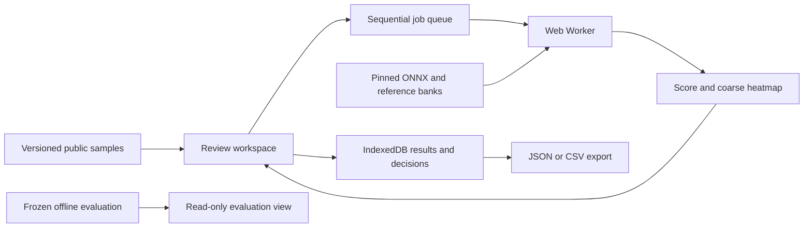

# Architecture

Inspection Desk is a static React application with a single inference worker. There is no API server, user database, login, or remote inference service.

## Runtime boundaries

- React owns selection, queue state, progress, review controls and rendering.
- The worker owns model loading, integrity checks, feature extraction and nearest-reference scoring. Only one image is processed at a time.
- Completed results and human decisions are stored independently in IndexedDB. An inference result never becomes a human disposition automatically.
- Cancellation terminates the worker and invalidates the active generation. Late responses cannot repopulate a reset session.
- Model failures stop the remaining queue rather than repeatedly downloading a broken resource. Manual review remains available.
- All runtime sample images are public benchmark material. No image is uploaded, and the application sends no reviewer notes or decisions to a server.

## Contracts and reproducibility

`src/types.ts` defines versioned sample, artifact, result, review and evaluation contracts. Every result carries the artifact version; every review links the result versions available when it was saved. Dataset and model split versions must agree before a job starts.

Preparation produces canonical 224 × 224 PNG inputs as well as original review images. Browser and offline execution decode the same canonical image bytes. This avoids hidden differences between browser and Python resizing libraries. Preprocessing transforms retain the original-image footprint so the heatmap can be mapped back without treating padded pixels as observations.

The inference runtime uses ONNX Runtime directly rather than the higher-level Transformers.js wrapper. This exposes the patch output explicitly and avoids a second model download or implicit preprocessing. Both browser and offline preparation use the same CPU/WASM execution provider and ONNX weights. An early fit-image check found material native CPU versus WASM quantisation differences, so native artifacts were discarded before publication and the complete experiment was rebuilt with WASM.

## Persistence and failure limits

IndexedDB is device-local and best-effort. Private browsing, quota exhaustion, or browser site-data clearing can remove persistence. Storage errors show a warning and leave the current tab usable; the visitor can export their work. This is not a central audit trail or a multi-user system.

Model and bank artifacts are immutable and checksum-validated. A cached mismatch must produce a visible error rather than an apparently valid score. Evaluation results are generated offline and loaded as an artifact; the UI does not estimate missing benchmark values.

## Out of scope

Factory acceptance decisions, safety certification, defect severity, arbitrary product categories, uploads, shared accounts, multi-reviewer approval and server monitoring are not implemented. A different camera, product or lighting setup requires a new evaluation.
